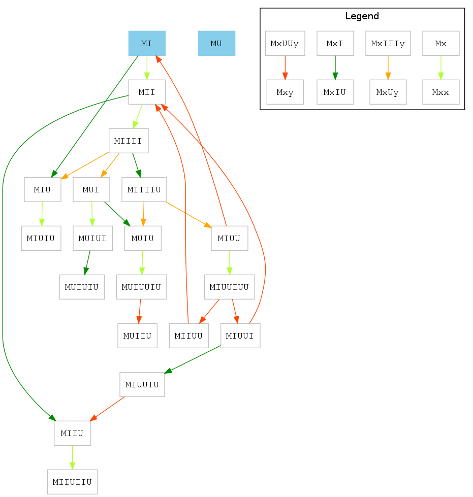

GEB MIU-puzzle graphs
=====================

(Initially written around the end of 2012.)

The problem
-----------

In Douglas Hofstadter's book *Gödel, Escher, Bach*, the reader is presented the following puzzle:

There are words consisting of the letters `M`, `I` and `U`. A word can be transformed into another word using one of four rules:

1. When there is `UU` somewhere in the word, it can be deleted. For example `MIUUIUU` can be transformed to `MIIUU` by deleting the first `UU`, or to `MIUUI` by deleting the second `UU`.

2. A `U` can be appended to a word whenever it ends in `I`. `MUI` becomes `MUIU` under this rule.

3. `III` can be replaced by `U`, for example `MIIIUI` becomes `MUUI`.

4. When a word begins with an `M`, everything that follows can be duplicated. For example `MUI` becomes `MUIUI`, or `MIIIIUU` becomes `MIIIIUUIIIIUU`.

When there are multple rules that can be applied at the same time, one of them can be chosen arbitrarily.

The puzzle is to start with the word `MI`, and to try to find a series of applications of the above rules to transform this word to `MU`.

The program
-----------

What the program does is simply taking a word, and producing the set of all possible words that can follow from this word in one step. It then does this procedure recursively, keeping track of how each word can be reached. The whole thing is aggregated into a graph showing all the correspondences, with the colour of the arrows indicating the applied rule.

The generated graphs, `miu*.png`, picture these graphs when all words and rules up to a certain length have been tried. Therefore, `miu8.png` will only show words up to length 8. (You'll notice that the longest word here is only 7 long though - that's because in order to create a 8-long word, you have to produce longer intermediate ones.)

The program is significantly faster than actually plotting its output, so it was not optimized any further.